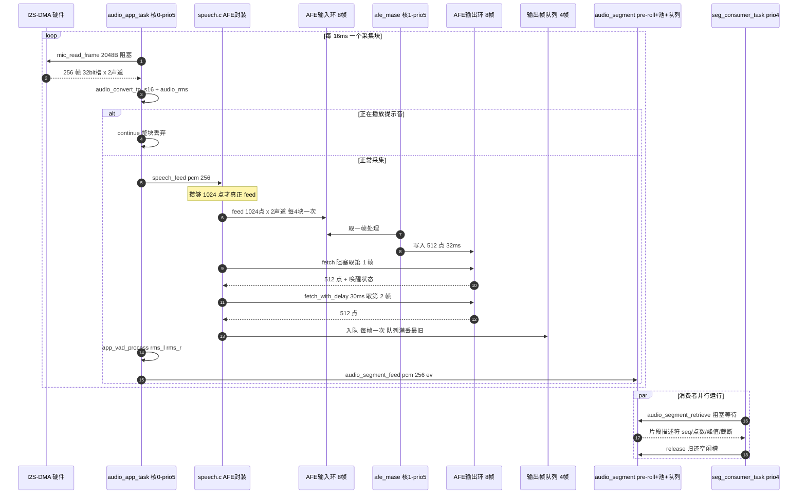

# 音频架构流程图与时序图

> 用途:理解"一次 16ms 采集块"在系统里怎么流动,以及各任务与缓冲之间的时序关系。
> 对照代码:`src/app/audio_app.c`、`src/app/speech.c`、`src/mic/mic_inmp441.c`、`src/app/audio_segment.c`
> 生成时间:2026-09-19

## 一、硬件与软件分层

```
        ┌──────────────── 硬件 ────────────────┐
        │  2×INMP441  ── I2S(DIN13) ──┐        │
        │  MAX98357A  ── I2S(DOUT12) ─┤        │
        │  AMP_EN=GPIO38              │        │
        │  BCLK=10  WS=11  (收发共用)  │        │
        └─────────────────────────────┼────────┘
                                      ▼
                    ESP32-S3 N16R8  (240MHz / 8MB PSRAM / 16MB Flash)
                                      │
   ┌──────────────────────────────────┴──────────────────────────────────┐
   │ 驱动层   mic_inmp441.c  I2S 全双工 RX/TX,32bit 槽位,16kHz,stereo     │
   │          audio_out.c    写 I2S + AMP_EN 时序(半双工)                 │
   └──────────────────────────────────┬──────────────────────────────────┘
                                      │
   ┌──────────────────────────────────┴──────────────────────────────────┐
   │ 服务层   audio_format.c  32bit 槽 -> int16 解码 / RMS                │
   │          vad.c           app_vad_process 自研 VAD(双门限 + 噪声底)   │
   │          audio_segment.c pre-roll 300ms + 3×5s 片段池 + 两条队列     │
   │          speech.c        AFE 封装(攒帧 / feed / fetch / 唤醒事件)    │
   │          storage.c       SPIFFS(/spiffs) 提示音资源                  │
   └──────────────────────────────────┬──────────────────────────────────┘
                                      │
   ┌──────────────────────────────────┴──────────────────────────────────┐
   │ 应用层   main.c            启动编排(顺序见第五节)                   │
   │          audio_app_task    采集主循环        优先级 5,栈 4096         │
   │          seg_consumer_task 片段消费者        优先级 4,栈 4096         │
   │          afe_mase          ESP-SR 内部 SE 任务 核 1,优先级 5          │
   └─────────────────────────────────────────────────────────────────────┘
```

## 二、任务与资源分配

| 任务 / 模块 | 谁创建 | 优先级 | 栈 | 运行核 | 职责 |
|---|---|---|---|---|---|
| `audio_app_task` | `main.c` | 5 | 4096 | 未绑定(核 0) | 读 I2S、解码、RMS、VAD、片段、喂 AFE |
| `seg_consumer_task` | `main.c` | 4 | 4096 | 未绑定 | 取完成片段、打印统计、归还空闲槽 |
| `afe_mase` | `create_from_config()` | 5 | 8KB | **核 1**(`afe_perferred_core`) | AFE 内部的 AEC/SE/NS/VAD/WakeNet 处理 |

关键缓冲:

| 缓冲 | 位置 | 大小 | 说明 |
|---|---|---|---|
| I2S RX DMA | 驱动内部 | 约 6×240 帧 | 硬件搬运,`mic_read_frame()` 阻塞读 |
| 原始块 `raw` | 内部 RAM | 2048 B / 块 | 32bit 槽 × 2 声道 × 256 帧 |
| 解码块 `pcm` | 内部 RAM | 1024 B / 块 | int16 × 2 声道 × 256 帧 |
| AFE 输入环 | AFE 内部(PSRAM) | 8 帧 × 1024 点 × 2 声道 | 我们 feed,`afe_mase` 消费 |
| AFE 输出环 | AFE 内部(PSRAM) | 8 帧 × 512 点 | `afe_mase` 生产,我们 fetch |
| 攒帧缓冲 `s_accum` | 内部 RAM | 1024 点 × 2 声道 | 4 个采集块凑一帧 |
| 输出帧队列 `s_out` | 内部 RAM | 4 帧 × 512 点 | `speech_take_frame()` 逐帧交付 |
| pre-roll | 内部 RAM | 300ms = 4800 点 | 补回 VAD 判到起始前的声音 |
| 片段池 | **PSRAM** | 3 × 5s = 480 KB | 单声道片段,循环复用 |

## 三、三条数据路径

### 3.1 唤醒路径(常开)

```
mic_read_frame(256帧) -> audio_convert_to_s16 -> speech_feed(pcm, 256)
   -> 攒够 1024 点 -> afe->feed() -> [AFE 内部:AEC关/SE/NS/VAD -> WakeNet10]
   -> afe->fetch() -> wakeup_state == WAKENET_DETECTED -> SPEECH_EVT_WAKE
```

### 3.2 片段路径(自研 VAD)

```
mic_read_frame(256帧) -> audio_convert_to_s16 -> audio_rms(左右声道)
   -> app_vad_process() -> VAD_EVENT_START/END
   -> audio_segment_feed(pcm, 256, ev)  [写入 pre-roll 与片段池]
   -> ready_q -> seg_consumer_task 取走 -> 打印 -> release 归还 free_q
```

注意:目前这条路径吃的是**原始下混 PCM**,不是 AFE 的输出(这是阶段二要改的点)。

### 3.3 播报路径(半双工,反向)

```
audio_out_play_file("/spiffs/wake.pcm")
   -> speech_set_wakenet(false)     关唤醒,避免把提示音当语音
   -> AMP_EN=1 -> 写 I2S(单声道 -> 32bit 立体声槽) -> 尾静音 -> AMP_EN=0
   -> speech_set_wakenet(true)      reset_buffer + 清空攒帧与输出队列
```

## 四、时序图(核心)

### 4.1 一次 AFE 帧的节拍

`feed_chunksize = 1024 点/通道(64ms)`,`fetch_chunksize = 512 点(32ms)`,
所以**每 4 个采集块(256 点)才 feed 一次**,每次 feed 会产出约 **2 帧**输出。

```
ms      0        16       32       48       64       80       96      112
        |--------|--------|--------|--------|--------|--------|--------|
采集块  [ 块1  ][ 块2  ][ 块3  ][ 块4  ][ 块5  ][ 块6  ][ 块7  ][ 块8  ]
攒帧    [---------- 攒到 1024 点 ----------]
feed                                              ^feed #1            ^feed #2
AFE内部          afe_mase(核1) 消费输入环,按 32ms 产出 512 点/帧
输出环                                            [帧1 32ms][帧2 32ms]
fetch                                             ^fetch1   ^fetch2(限时30ms)
输出队列                                          [ 512 点 ][ 512 点 ]
VAD/片段[ev][ev][ev][ev][ev][ev][ev][ev]   每个采集块(16ms)一次
```

要点:采集是 16ms 节拍,AFE 是 64ms 输入 / 32ms 输出的节拍,VAD 与片段仍是 16ms 节拍——
三种节拍在同一任务里串行执行,这就是当前架构的复杂度来源。

### 4.2 时序图(GitHub 上可直接渲染)



### 4.3 关键时序参数

| 项目 | 数值 | 换算 |
|---|---|---|
| 采集块 | 256 帧 | 16 ms |
| AFE 输入帧 | 1024 点/通道 | 64 ms(4 块) |
| AFE 输出帧 | 512 点 | 32 ms |
| feed : fetch | 1 : 2 | 一次 feed 取两帧 |
| VAD 判定帧 | 256 点 | 16 ms |
| VAD 起始/结束 | 3 帧 / 18 帧 | 48 ms / 288 ms |
| pre-roll | 300 ms | 4800 点 |
| 片段池 | 3 × 5 s | 480 KB(PSRAM) |
| 输出队列 | 4 帧 | 128 ms |
| 提示音时长 | 0.32 ~ 0.55 s | 半双工独占 |

## 五、启动顺序(main.c)

```
mic_init()                      I2S 全双工通道建立
audio_out_init()                AMP_EN 拉低(静音)
storage_init()                  挂载 SPIFFS
audio_segment_init(16k,5s,3)    分配 PSRAM 片段池 + pre-roll + 队列
audio_out_play_file(wake.pcm)   开机提示音(此时 AFE 还没起来)
speech_init()                   挂载模型 -> 建 AFE -> 建 WakeNet
xTaskCreate(audio_app_task,  prio 5)
xTaskCreate(seg_consumer_task, prio 4)
```

## 六、当前瓶颈(重要)

```
采集任务实际时间轴:
|<----- 64ms 音频(4 块) ----->|<-- 等 AFE 出帧 ~32ms -->|
                              ^feed        ^fetch 阻塞返回
一个周期 ≈ 96ms > 64ms 音频
```

`speech_feed()` 里的**阻塞式 fetch** 在采集任务里等 AFE 出帧,这段等待是加在 64ms 音频周期之外的
串行开销。实测采集只跑到实时的约 61%,也就是 I2S DMA 溢出、丢了约 40% 的麦克风音频。

正确的结构是把两边解耦(官方例程也是这么做的):

```
采集任务(高优先级)  I2S 读 -> 解码 -> VAD/片段 -> PCM 环形缓冲
speech 任务         从环形缓冲取 PCM -> 攒帧 -> feed -> fetch(随便等)
```

这样采集任务永远不会被 AFE 的等待拖住,I2S 也就不会溢出。
